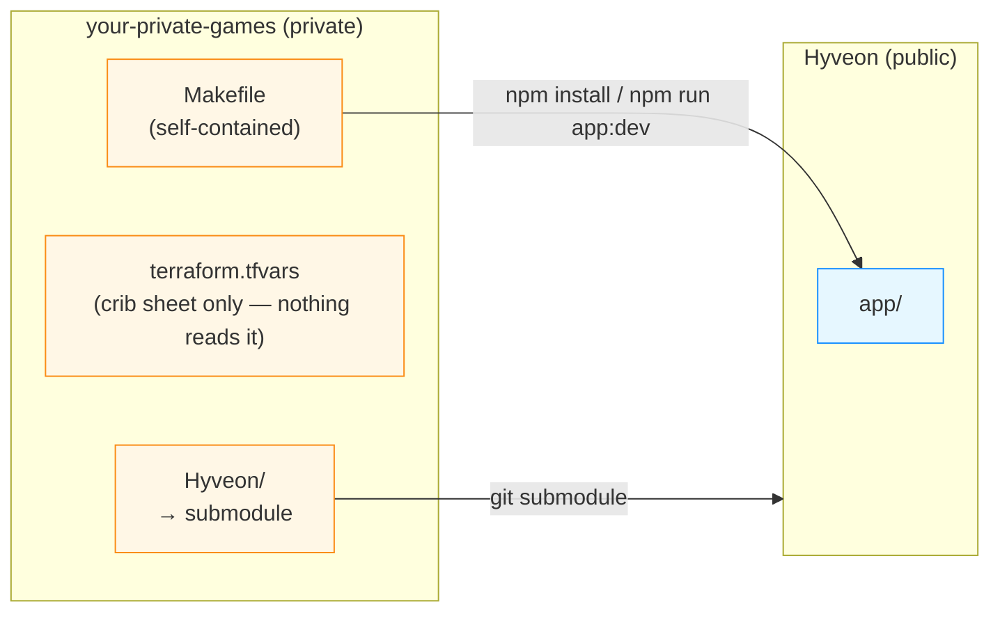

# Private parent repo + submodule

This is the pattern for running the stack from source while keeping your
own operational notes and a pinned upstream version separate from the
public repo: a **private parent repo** you own, with this repo vendored as
a git submodule. Pulling upstream changes is one `make update` away.

If you're just kicking the tyres, the plain
[setup guide](/setup) is fine. Come back to this
page when you want a from-source checkout you control the version of.

:::note This is not a secrets-storage pattern any more
Before the `migrate-iac-to-pulumi` change, this page's main job was keeping
`terraform.tfvars` and Terraform state out of the public repo. Neither
exists today: AWS credentials are encrypted in your OS keychain by the
in-app setup wizard, Discord secrets live in AWS Secrets Manager, your game
configuration lives in a versioned S3 object the app manages
(`deployment-config.json`), and Pulumi's own state lives in a second S3
bucket the wizard also provisions. None of that touches this repo or its
submodule checkout. What this pattern buys you now is a pinned submodule
commit and a three-line wrapper for running from source — not a place to
hide secrets. This whole workflow is **maintainer-only**; an operator
running the packaged app needs none of it.
:::

## Why this layout

- **A pinned version.** The submodule points at an exact commit, so you
  control exactly which Hyveon version you run and bump it deliberately
  with `make update`, rather than always tracking `main`.
- **A private place for your own notes.** Anything you want kept out of
  the public repo — deployment notes, a crib sheet of your wizard answers,
  per-game world configuration outside the app — has somewhere to live.
- **A three-line `make` wrapper** for running the app from source instead
  of building or installing it yourself.



## Reference layout

```text
your-private-games/                 # private repo you own
├── .gitmodules
├── .gitignore
├── Makefile                        # self-contained wrapper — see "What the wrapper does" below
├── terraform.tfvars                # a crib sheet of your wizard answers — not read by the app
└── Hyveon/             # submodule → CoderCoco/Hyveon
```

## Quick start (interactive scaffolder)

The public repo ships an interactive TypeScript script that writes the
files above for you — `Makefile`, `terraform.tfvars`, and `.gitignore`
(`.gitmodules` is created by `git submodule add` in step 2 below). It only
needs Node.js 24+, which you already need for the rest of the project.

```bash
# 1. Create a private repo on GitHub, then clone it.
git clone git@github.com:you/your-private-games.git
cd your-private-games

# 2. Add the submodule.
git submodule add https://github.com/CoderCoco/Hyveon.git

# 3. Install all deps and run the scaffolder.
(cd Hyveon && npm install)
(cd Hyveon && npm run scripts:init-parent)
```

The script prompts for a parent-repo path, the submodule path, a project
name (used only as a starting value in the generated `terraform.tfvars`
crib sheet — see below), an AWS region, a hosted zone, and optionally
Discord credentials, then writes `Makefile`, `terraform.tfvars`, and
`.gitignore`. Existing files are skipped unless you pass `--force`.

```bash
init-parent.ts [--force] [--yes]            Interactive bootstrap
```

`--force` overwrites existing `Makefile`/`terraform.tfvars`/`.gitignore`
instead of skipping them. `--yes` is currently a no-op — every prompt runs
interactively regardless — kept only for backwards compatibility with
older invocations. There is no `migrate` subcommand and no `--s3-tfvars`
flag any more; both belonged to the Terraform-era tfvars S3 backend, which
no longer exists.

After it finishes:

```bash
$EDITOR terraform.tfvars            # jot down at least one entry under game_servers
make setup                          # init submodule, install deps, build Lambda bundles
make dev                             # launch the app and complete the first-run wizard
```

Add your game(s) and deploy from inside the running app — see
[step 3 onward of the setup guide](/setup#3-add-your-first-game). The
generated `terraform.tfvars` is **not** read by anything; it exists purely
as a human-readable crib sheet of what you're about to type into the
wizard and the Games page. Don't rely on editing it to change anything —
it has no effect on the running app.

## What the wrapper Makefile does

The generated wrapper is fully self-contained — every step is inlined
directly in its recipes; it never shells out to a script or another
Makefile inside the submodule. Four targets are declared
(`.PHONY: help setup update dev`); `make help` just prints the usage text
below, so the table covers the three that actually do something:

| Target | What it does |
|---|---|
| `make setup` | One-time bootstrap. Runs `git submodule update --init --recursive`, then `npm install` and `npm run app:build:lambdas` in the submodule. Does **not** touch AWS at all — the AWS backend bootstrap and the Pulumi stack deploy are both handled by the app itself, via its first-run wizard and its Infrastructure page. |
| `make update` | Bumps the submodule to the tip of `main` (`git submodule update --remote --merge`), then reminds you to commit the new submodule pointer. Does not rebuild or re-run anything else — if upstream changed dependencies or added a workspace, `make setup` again. |
| `make dev` | Wipes stale TypeScript build info under the submodule's `app/packages/*/`, then runs `npm run app:dev` directly in the submodule — currently broken (see the [maintainer guide](/guides/maintainer)'s scripts table); build with `desktop:build` and launch with `app:start` in the submodule instead. |

:::note `make dev`'s output still mentions Terraform — this is a known leftover
The generated recipe's first line attempts a `terraform state pull` against
a `terraform/` directory the submodule no longer has, and sets
`TF_STATE_PATH` — an environment variable nothing in the app reads any
more (removed as dead code in an earlier phase of this migration). The
`terraform state pull` always fails silently (its output is redirected and
the failure is swallowed), so this step is harmless but pointless — it
does not block `make dev`, and the app itself needs neither the file nor
the env var. This is tracked as a generator cleanup, not something you need
to work around.
:::

There is no `make plan`/`make apply` any more, and no `tfvars-pull`/
`tfvars-push`/`tfvars-diff` targets — those belonged to the old
Terraform-CLI workflow and the S3 tfvars-sync backend built around it. The
app's first-run wizard and its [Infrastructure](/app/iac) page replace all
of that from inside the running app.

## `scripts/tfvars-sync.ts` is legacy tooling, not part of this workflow

The public repo still ships a standalone `tfvars-sync.ts` CLI
(`npm run scripts:tfvars-sync`) that can pull/push/diff a `terraform.tfvars`
object against the S3 bucket the wizard provisions for your JSON
configuration — but the app itself never reads the `terraform.tfvars`
object key that tool syncs; it exclusively reads and writes
`deployment-config.json` in the same bucket. This generated Makefile does
not wire it up, and neither should you unless you have your own separate
reason to keep a `terraform.tfvars`-shaped mirror in sync — it is not
required for anything described on this page.

## Keeping up with upstream

```bash
make update
git add Hyveon
git commit -m "chore: bump Hyveon to $(git -C Hyveon rev-parse --short HEAD)"
make setup   # re-run in case dependencies or the Lambda build changed
```

Things that tend to need attention after a bump:

- New fields on a game's configuration → visit the Games page and re-save
  the game, or check the [Games](/app/games) docs for what's new.
- New environment variables on the Lambdas → the next apply from the
  Infrastructure page picks these up automatically; nothing to do by hand.
- Changes to the four slash-command descriptors → re-click **Register
  commands** in the dashboard so Discord picks them up per guild.

## What NOT to do

- **Don't fork the public repo and edit it.** The submodule pattern gives
  you every pinning benefit of a fork without the merge conflicts. If you
  need a real code change, contribute upstream and `make update` to bump
  to the new commit.
- **Don't rely on `terraform.tfvars` for anything.** It's a crib sheet the
  scaffolder writes for your own reference — nothing in the app reads it.
  Your actual configuration lives in the app's S3 configuration bucket,
  edited from the Games page.
- **Don't try to run a Terraform command anywhere in this repo.** The
  `terraform/` tree is gone; there is no `.tf` file left to run one
  against.

## Troubleshooting

| Symptom | Cause | Fix |
|---|---|---|
| `make setup` says "No such file or directory" pointing at `Hyveon/` | Submodule wasn't initialised | `make setup` again (it runs `git submodule update --init --recursive` itself), or `git submodule update --init --recursive` by hand. |
| `make update` silently pulls main and something breaks | Upstream changed something incompatible | `update` only bumps the submodule pointer and reminds you to commit — it doesn't rebuild anything. Run `make setup` again and check the app's own changelog/PR history for what changed. Pin to a SHA in `.gitmodules` if you want stricter control. |
| After bumping upstream, Discord commands have wrong arguments | Descriptors in `@hyveon/shared/commands.ts` changed | Click **Register commands** for each guild in the dashboard. |
| `make dev` prints a Terraform-related line before the app starts | Known generator leftover — see the note above | Harmless; ignore it. The app needs neither the file nor the env var it's trying to set. |
